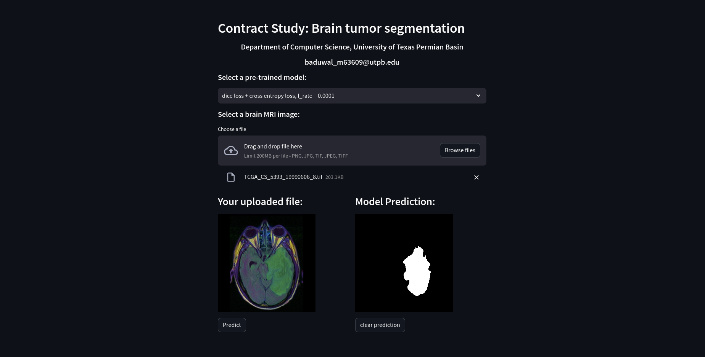

#  Brain tumor segmentation

One of the primary challenges in planning and quantitatively evaluating brain tumor treatments lies in accurately determining the extent of the tumor. The noninvasive technique of magnetic resonance imaging (MRI) has become a leading diagnostic tool for brain tumors, offering the advantage of avoiding ionizing radiation. However, manually segmenting the extent of a brain tumor from 3D MRI volumes is a labor-intensive process, heavily dependent on the operator's experience. In light of this, the development of a reliable, fully automatic segmentation method becomes crucial for efficiently measuring the tumor's extent. In this study I will introduce a fully automatic approach for brain tumor segmentation, utilizing U-Net-based deep convolutional networks. The method was assessed using the Multimodal Brain Tumor Image Segmentation (BRATS 2020) datasets, comprising 220 high-grade brain tumor cases and 54 low-grade tumor cases. Cross-validation results indicate that my method can achieve efficient and promising segmentation.


# Data

You can download data from here: [Data](https://www.kaggle.com/datasets/mateuszbuda/lgg-mri-segmentation)


# Installation and Prerequisites

```
git clone https://github.com/madanbaduwal/brain-tumor-segmentation


cd project

python -m venv myenv


source myenv/bin/activate


pip3 install -r requirements.txt

```


## Training Model

* Train the model by runninng `train.py`:


## Make Prediction

* open the page by running `streamlit run app.py` in terminal.


## Demo




